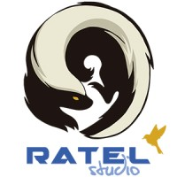
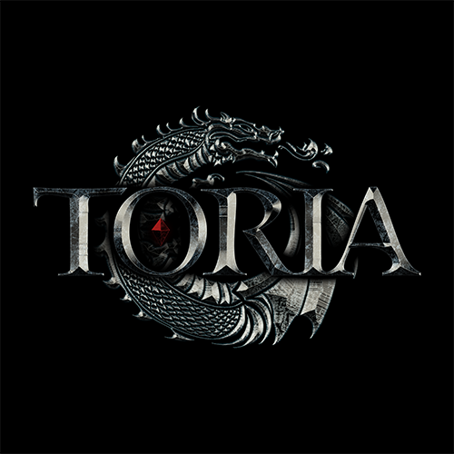
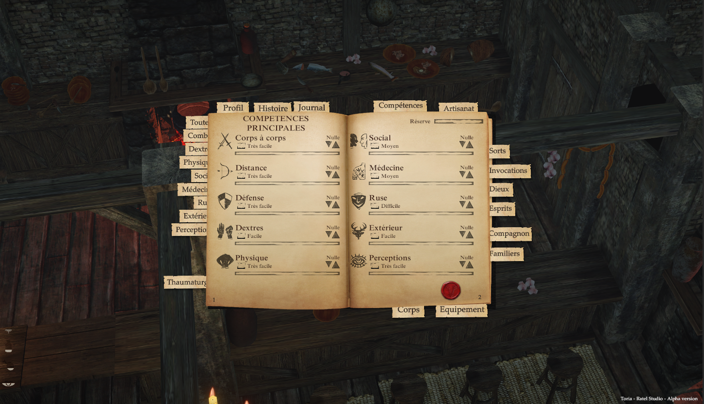
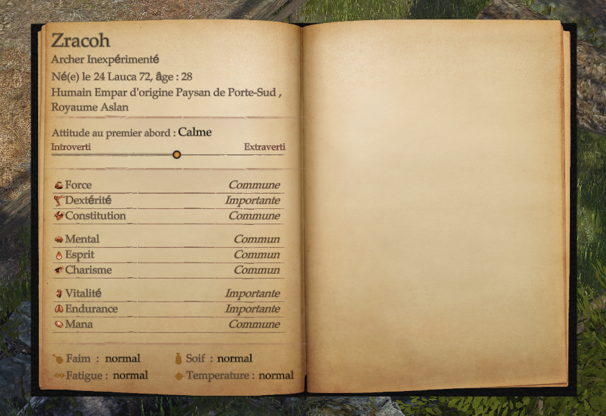
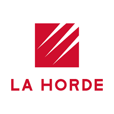

# ANGAROS

> Currently a student at Bordeaux Ynov and an apprentice at Movida Production, I have a strong interest in engine development.
Passionate about a wide range of topics such as music production, video game development, and engine development, I am a versatile and dedicated student committed to my learning journey.  

## WHAT DO I DO FOR A LIVING ?

### 2024 - ??? | ApprenticeShip @Movida Production 

I am currently an apprentice at Movida Productions. As part of my studies, I need to complete a two-year apprenticeship. With this in mind, I joined Movida.  
My main responsibilities involve bug fixing and restoring functionality to systems that were created by the company before my arrival.  
Additionally, I need to learn programming languages such as Go and Python in order to take on several other tasks in the future.  
 
### 2022 | Internship @RatelStudio

 

Ratel Studio is an independent game development studio based in Bordeaux.  

During my two-month internship at Ratel Studio, I gained various skills and completed tasks that brought me closer to the reality of Gameplay development.  
I learned how to work with a game-server structure and navigate through a large codebase.  
I was then tasked with setting up an interface to display the player’s skills and professions.  
Additionally, I implemented various gameplay systems and performed bug fixes.  

## Studies

### 2024 - 2026 | Ynov Campus 

The Video Game Master's program at Ynov Bordeaux is designed to prepare students for careers in the dynamic and competitive gaming industry. 
Combining technical expertise, creativity, and project management, the program covers key aspects of game development

### 2021 - 2024 | La Horde

La Horde is a cutting-edge school located in Bordeaux, specializing in game design and development. 
It offers an innovative and immersive educational experience, focusing on project-based learning and hands-on collaboration.

## WHAT DO I DO FOR FUN ?

### Demoscene 

The demoscene is a global computer art subculture focused on creating real-time audiovisual presentations, known as demos, that showcase programming, artistic, and musical skills.

#### Revision 2024 

During this edition of Revision, we released a track called [Pixels and Paradise](https://soundcloud.com/user-519993791/pixels-and-paradise?utm_source=clipboard&utm_medium=text&utm_campaign=social_sharing) with [Xtrium](https://github.com/xtrium-lnx).

#### Evoke 2023

Evoke 2023 was the first demoparty we participated in.  
We released our first demo, called "Achievement Unlocked," with [Xugon](https://github.com/vmalvoisin).

This demo was produced in two days during Evoke 2023.  
We used C++ with OpenGL for context rendering and GLSL for shader coding.

You can find the demo track on SoundCloud [HERE](https://soundcloud.com/user-519993791/achievement-unlocked?utm_source=clipboard&utm_medium=text&utm_campaign=social_sharing).  
You can also find the demo release [HERE](https://github.com/FreshBloodDemoscene/AchivementUnlocked-Evoke2023/releases/tag/V1.0.0).

We won the Newcomer Award at this first edition.  
The demo was ranked 8th overall.

### SoundMaking

These are all the tracks that are available in my [SoundCloud](https://soundcloud.com/user-519993791/).

> - [Celeste](https://soundcloud.com/user-519993791/celeste?utm_source=clipboard&utm_medium=text&utm_campaign=social_sharing)
> - [Pixels and Paradise](https://soundcloud.com/user-519993791/pixels-and-paradise?utm_source=clipboard&utm_medium=text&utm_campaign=social_sharing)
> - [Achievement Unlocked](https://soundcloud.com/user-519993791/achievement-unlocked?utm_source=clipboard&utm_medium=text&utm_campaign=social_sharing)

